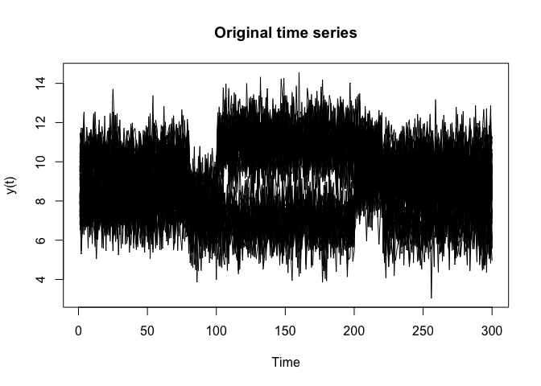
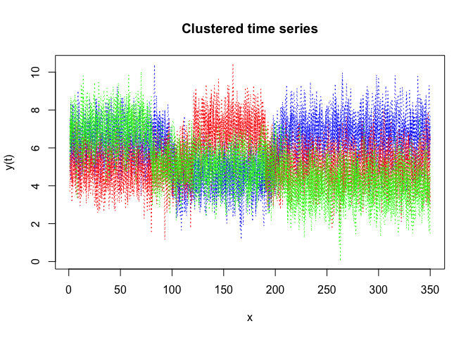
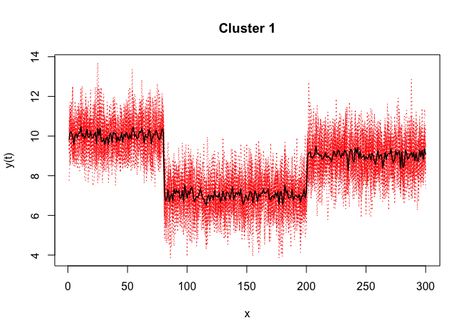
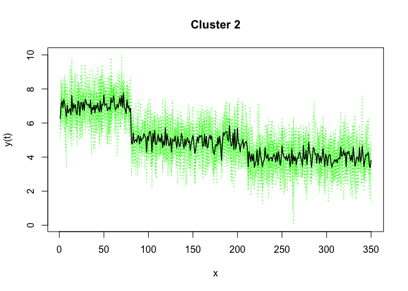
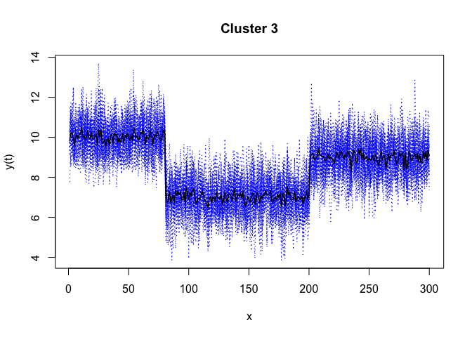

<!-- README.md is generated from README.Rmd. Please edit that file -->

## Overview

<!-- badges: start -->

<!-- badges: end -->

R code for the **clustering** and **segmentation** of time series
(including with regime changes) by mixture of gaussian Hidden Markov
Models (MixHMMs) and the EM algorithm; i.e functional data clustering
and segmentation.

## Installation

You can install the development version of mixHMM from
[GitHub](https://github.com/) with:

``` r
# install.packages("devtools")
devtools::install_github("fchamroukhi/mixHMM")
```

To build *vignettes* for examples of usage, type the command below
instead:

``` r
# install.packages("devtools")
devtools::install_github("fchamroukhi/mixHMM", 
                         build_opts = c("--no-resave-data", "--no-manual"), 
                         build_vignettes = TRUE)
```

Use the following command to display vignettes:

``` r
browseVignettes("mixHMM")
```

## Usage

``` r
library(mixHMM)

data("simulatedtimeseries")
fData <- FData$new()
fData$setData(simulatedtimeseries$X, t(simulatedtimeseries[, 2:ncol(simulatedtimeseries)]))

K <- 3 # Number of clusters
R <- 3 # Number of regimes (HMM states)
variance_type = variance_types$hetereskedastic
modelMixHMM <- ModelMixHMM(fData, K, R, variance_type)

ordered_states <- TRUE
n_tries <- 1
max_iter <- 1000
init_kmeans <- TRUE
threshold <- 1e-6
verbose <- TRUE

solution <- EM(modelMixHMM, ordered_states, n_tries, max_iter, init_kmeans, threshold, verbose)
#> [1] "EM try n? 1"
#> [1] "EM : Iteration : 1 log-likelihood :  -28768.651771201"
#> [1] "EM : Iteration : 2 log-likelihood :  -22339.2695187269"
#> [1] "EM : Iteration : 3 log-likelihood :  -21960.4137394824"
#> [1] "EM : Iteration : 4 log-likelihood :  -21838.6832023488"
#> [1] "EM : Iteration : 5 log-likelihood :  -21826.0254324452"
#> [1] "EM : Iteration : 6 log-likelihood :  -21825.2945545122"
#> [1] "EM : Iteration : 7 log-likelihood :  -21825.2614076716"
#> [1] "EM : Iteration : 8 log-likelihood :  -21825.2600749497"
#> [1] "log-lik at convergence: -21825.2600749497"

solution$plot()
```


